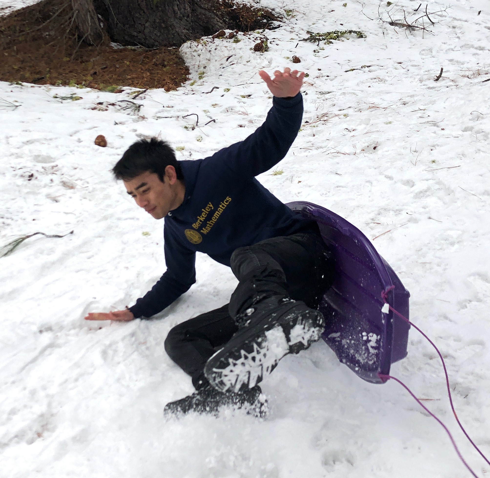

# Table of Contents

1.  [Introduction](#org415634c)
2.  [Resume](#org5911dc9)
3.  [Highlighted Projects](#org25fbdb8)
4.  [Contact and External Links](#org4ba0b14)
5.  [Photo](#org5c0c235)

# Introduction

Thanks for stopping by my corner of the internet!
I'm currently a student at UC Berkeley studying computer science and math.
Specifically, I'm interested in computer security and program synthesis.
I currently work part-time as an operations intern at [Berkeley Research Computing](https://research-it.berkeley.edu/programs/berkeley-research-computing).
Outside of school and work, I play the clarinet in the [Cal Band](http://calband.berkeley.edu) and wind ensemble!

# Resume

-   [Nicolas Chan's 2020 Resume](./static/docs/resume-2020.pdf)

# Highlighted Projects

Most of my projects are listed on [github/nicolaschan](https://github.com/nicolaschan).
Some projects date all the way back to high school.

-   [ip-anonymize](https://github.com/nicolaschan/ip-anonymize)
-   [bell.plus](https://github.com/nicolaschan/bell)
-   [minecraft-backup](https://github.com/nicolaschan/minecraft-backup)
-   [mines](https://github.com/nicolaschan/mines)
-   [mithril-selector](https://github.com/nicolaschan/mithril-selector)

# Contact and External Links

-   Email: [nicolas@nicolaschan.com](mailto:nicolas@nicolaschan.com).
-   PGP Key: [8DBC0513271A2454FC337F304CFAEA5126A70C2A](https://pgp.ocf.berkeley.edu/pks/lookup?op=get&search=0x4CFAEA5126A70C2A).
-   GitHub: [github/nicolaschan](https://github.com/nicolaschan)

# Photo

